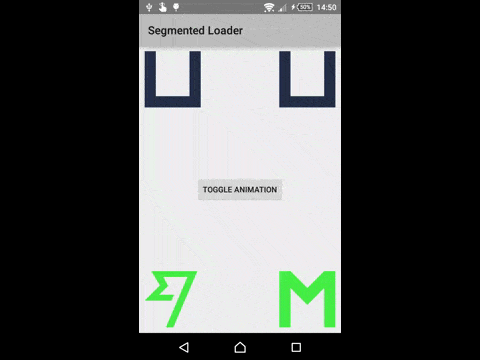

# SegmentedLoader

##Description

Small library allowing you to create a custom loader based on segments.

##Demo:



##Integration

**SegmentedLoader** (min API 14):  [  ](https://bintray.com/dbottillo/maven/segmented-library/_latestVersion)

All you have to do is add it on your gradle build:

```groovy
dependencies {
    compile 'com.github.dbottillo:segmented-loader:0.9.0'
}
```

##Usage

Use directly SegmentedLoader:

```xml
<com.danielebottillo.segmentedloader.SegmentedLoader
	android:id="@+id/loader"
	android:layout_width="100dp"
	android:layout_height="100dp"
	myapp:speed="5000"
	myapp:start_color="#45ef45"
	myapp:middle_color="#DF321D"
	myapp:end_color="#FFE714"
	myapp:reversed="true"
	myapp:fill_on_start="true"
/>
```

Then you need to specify the segments of your loader. <br/>
Every segments is composed by 4 coordinates: the starting left point, the starting right point and the end left/right points. 
To specify a segment you have two choice:

- integer values against a grid: so imagine you have a grid of 10x10 you can specify integer coordinates of the grid (by default grid size is 10)

```java
SegmentedLoader  loader = (SegmentedLoader) findViewById(R.id.loader);
loader.addSegment(new Segment().setStartLeftPoint(0, 0).setStartRightPoint(2, 0).setEndRightPoint(2, 10).setEndLeftPoint(0, 10));
```

you can also specify the grid size in the constructor:

```java
loader.addSegment(new Segment(10).setStartLeftPoint(0, 0).setStartRightPoint(2, 0).setEndRightPoint(2, 10).setEndLeftPoint(0, 10));
```

or use an handy constructor with all the information at the same time:

```java
loader.addSegment(new Segment(10, 2, 10, 2, 8, 10, 8, 10, 10));
```

- you can also specify float numbers using a grid of 1.0fx1.0f size, in this way you have a complete control of segment position:

```java
loader.addSegment(new Segment().setStartLeftPoint(.5249f, .419f).setStartRightPoint(.4798f, .5239f).setEndRightPoint(.0f, .5239f).setEndLeftPoint(.25f, .419f));
```

After you have specified all the segments you can start the animation with:

```java
loader.startAnimation();
```

If you don't start the animation or if you stop the animation, the loader will be filled with the start color.

You can also specify:

- start/middle/end color
- if the animation is reversed
- the speed

Complete code of demo above:

```java
SegmentedLoader  loader = (SegmentedLoader) findViewById(R.id.loader);
loader.addSegment(new Segment().setStartLeftPoint(0, 0).setStartRightPoint(2, 0).setEndRightPoint(2, 10).setEndLeftPoint(0, 10));
loader.addSegment(new Segment(10, 2, 10, 2, 8, 10, 8, 10, 10));
loader.addSegment(new Segment(10, 8, 8, 10, 8, 10, 0, 8, 0));
loader.setSpeed(1500);

SegmentedLoader loaderReversed = (SegmentedLoader) findViewById(R.id.loader_inverted);
loaderReversed.addSegment(new Segment().setStartLeftPoint(0, 0).setStartRightPoint(2, 0).setEndRightPoint(2, 10).setEndLeftPoint(0, 10));
loaderReversed.addSegment(new Segment(10, 2, 10, 2, 8, 10, 8, 10, 10));
loaderReversed.addSegment(new Segment(10, 8, 8, 10, 8, 10, 0, 8, 0));
loaderReversed.setSpeed(1500).setReversed();

SegmentedLoader  loaderThreeColors = (SegmentedLoader) findViewById(R.id.loader_three_colors);
loaderThreeColors.addSegment(new Segment(10, 0, 10, 2, 10, 2, 0, 0, 0));
loaderThreeColors.addSegment(new Segment(10, 2, 0, 2, 3, 5, 6, 5, 3));
loaderThreeColors.addSegment(new Segment(10, 5, 3, 5, 6, 8, 3, 8, 0));
loaderThreeColors.addSegment(new Segment(10, 8, 0, 10, 0, 10, 10, 8, 10));
loaderThreeColors.setSpeed(3000);

SegmentedLoader  loaderThreeColorsReversed = (SegmentedLoader) findViewById(R.id.loader_three_colors_inverted);
loaderThreeColorsReversed addSegment(new Segment().setStartLeftPoint(.5249f, .419f).setStartRightPoint(.4798f, .5239f).setEndRightPoint(.0f, .5239f).setEndLeftPoint(.25f, .419f));
loaderThreeColorsReversed.addSegment(new Segment().setStartLeftPoint(.2602f, .419f).setStartRightPoint(.0f, .5239f).setEndRightPoint(.2775f, .25f).setEndLeftPoint(.4204f, .2615f));
loaderThreeColorsReversed.addSegment(new Segment().setStartLeftPoint(.4204f, .2641f).setStartRightPoint(.2775f, .2621f).setEndRightPoint(.1192f, .0f).setEndLeftPoint(.3268f, .0949f));
loaderThreeColorsReversed.addSegment(new Segment().setStartLeftPoint(.3268f, .1049f).setStartRightPoint(.1192f, .0f).setEndRightPoint(.94f, .0f).setEndLeftPoint(.7734f, .1049f));
loaderThreeColorsReversed.addSegment(new Segment().setStartLeftPoint(.7634f, .1049f).setStartRightPoint(.94f, .0f).setEndRightPoint(.5115f, 1.0f).setEndLeftPoint(.3801f, 1.0f));
loaderThreeColorsReversed.setReversed();
```

##License

```
Copyright 2015 Daniele Bottillo

Licensed under the Apache License, Version 2.0 (the "License");
you may not use this file except in compliance with the License.
You may obtain a copy of the License at

    http://www.apache.org/licenses/LICENSE-2.0

Unless required by applicable law or agreed to in writing, software
distributed under the License is distributed on an "AS IS" BASIS,
WITHOUT WARRANTIES OR CONDITIONS OF ANY KIND, either express or implied.
See the License for the specific language governing permissions and
limitations under the License.
```